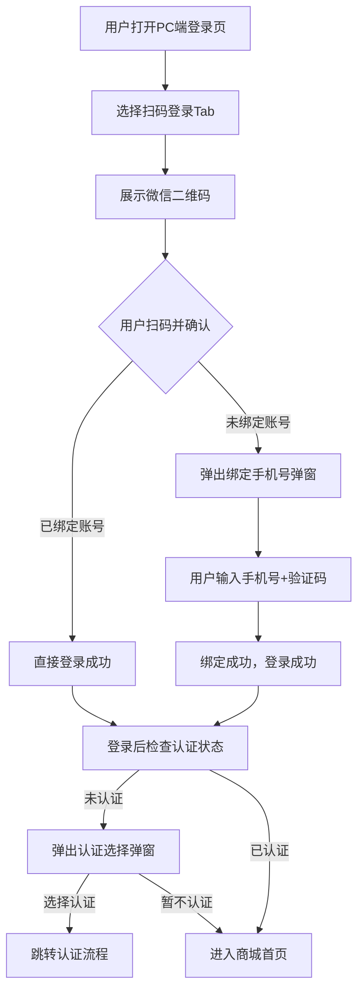
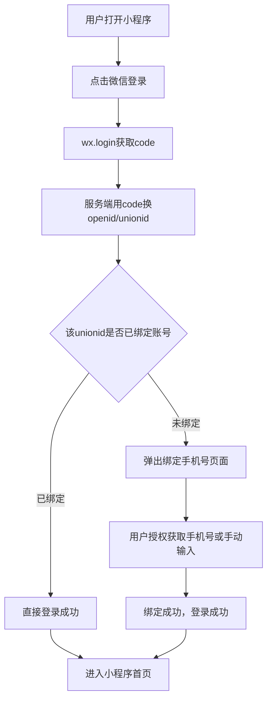
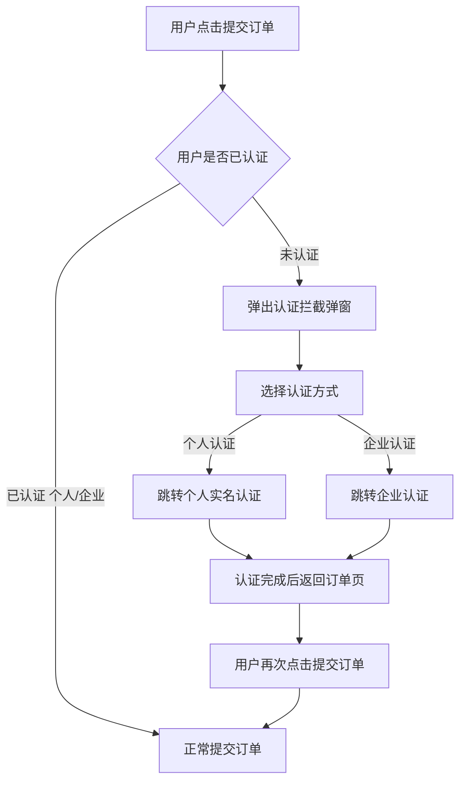

# 微信登录功能 PRD

## 一、需求背景

数智聚模当前登录方式仅有账号密码和短信验证码，用户登录门槛较高，导致用户转化率偏低。通过微信登录，利用用户已登录的微信账号实现快速登录，降低注册/登录门槛，提升用户转化率。

同时，登录后引导用户完成实名认证（个人/企业），**认证不强制但下单前必须完成**，支持PC端和小程序端多端账号打通。

---

## 二、需求目标

| 目标 | 说明 |
|------|------|
| 提升登录转化率 | 微信扫码/授权登录，一键完成，缩短用户注册-登录路径 |
| 多端账号打通 | PC端和小程序端通过unionid识别同一用户，用户在任一端登录后，另一端无需重新绑定 |
| 登录即注册 | 首次微信登录自动创建账号，绑定手机号后完成注册 |
| 认证引导 | 登录后引导用户完成实名认证（个人/企业），下单前必须认证 |

---

## 三、核心业务流程图

### 3.1 微信扫码登录流程（PC端）

### 3.2 小程序微信登录流程

### 3.3 下单认证拦截流程

---

## 四、需求功能清单

| 终端 | 模块 | 功能 | 描述 |
|------|------|------|------|
| PC端 | 登录页 | 扫码登录Tab | 展示微信二维码，支持刷新，扫码后进入绑定或登录流程 |
| PC端 | 登录页 | 密码登录Tab | 账号+密码登录，支持30天免登录 |
| PC端 | 登录页 | 验证码登录Tab | 手机号+短信验证码登录，60秒倒计时 |
| PC端 | 登录页 | 次要登录图标 | 每个Tab底部显示其他两种登录方式图标，点击可切换 |
| PC端 | 登录页 | 微信一键登录 | 扫码Tab下方展示微信快捷登录按钮，点击跳转微信授权页 |
| PC端 | 弹窗 | 绑定手机号 | 首次微信登录弹出，填写手机号+验证码完成绑定 |
| PC端 | 弹窗 | 认证选择弹窗 | 登录成功后自动弹出，引导用户选择个人认证/企业认证/暂不认证 |
| 小程序端 | 登录页 | 微信授权登录 | 点击微信登录按钮，wx.login获取code，服务端完成登录 |
| 小程序端 | 登录页 | 手机号绑定 | 首次登录弹出，支持一键获取手机号或手动输入 |
| 买家中心 | 认证入口 | 实名认证 | 随时可主动发起认证，已认证用户可查看认证信息 |
| 全局 | 下单流程 | 认证拦截 | 未认证用户提交订单前拦截，引导完成认证 |

---

## 五、需求功能详述

### 5.1 PC端——登录页——扫码登录Tab

**原型描述**：
扫码登录Tab居首位，展示180×180px微信二维码，下方提示"打开微信 > 发现 > 扫一扫"。二维码有效期5分钟，过期显示刷新按钮。

**用户故事**：
> 作为一个访客，我想要用微信扫码登录，以便于无需记住账号密码即可快速登录。

**前置条件**：
- PC端网站应用已在微信开放平台通过审核
- 授权回调域名已配置

**核心逻辑**：
- 二维码5分钟有效期，过期需刷新
- 扫码后需用户在手机微信内确认授权
- 确认后服务端通过code换取openid和unionid

**验收标准**：
- 🎯 二维码正常展示，扫码后可登录
- 🎯 首次扫码（新用户）跳转绑定手机号流程
- 🎯 老用户直接登录，无需绑定

**测试用例**：
- 已注册微信号扫码登录成功
- 未注册微信号扫码弹出绑定手机号
- 二维码过期显示刷新按钮

---

### 5.2 PC端——登录页——密码登录Tab

**原型描述**：
账号输入框支持邮箱/手机号，密码输入框支持显示/隐藏，底部有"30天内免登录"复选框和"忘记密码"链接。

**验收标准**：
- 🎯 正确账号密码登录成功
- 🎯 错误密码提示登录失败
- 🎯 勾选30天免登录后30天内无需重复登录

---

### 5.3 PC端——登录页——验证码登录Tab

**原型描述**：
手机号输入框+验证码输入框（右侧获取验证码按钮，60秒倒计时），底部有"30天内免登录"复选框。

**核心逻辑**：
- 获取验证码60秒内不可重复点击
- 验证码5分钟内有效

**验收标准**：
- 🎯 正确手机号+验证码登录成功
- 🎯 错误验证码提示失败
- 🎯 60秒内不可重复获取验证码

---

### 5.4 PC端——登录页——次要登录图标

**原型描述**：
每个Tab底部有一行"其他登录方式"，展示另外两种登录方式的小图标（带文字），点击切换到对应Tab。

**核心逻辑**：
- 扫码Tab底部：密码登录图标、验证码登录图标
- 密码Tab底部：微信扫码图标、验证码登录图标
- 验证码Tab底部：微信扫码图标、密码登录图标
- 点击切换Tab，已填内容不清空

**验收标准**：
- 🎯 各Tab底部正确展示其他两种登录方式图标
- 🎯 点击图标可正常切换，内容不清空

---

### 5.5 PC端——登录页——微信一键登录

**原型描述**：
扫码Tab下方有"微信快捷登录"绿色按钮，点击弹出确认弹窗，用户确认后跳转微信授权页。

**用户故事**：
> 作为一个移动端用户，我想要一键授权微信登录，以便于省略输入账号密码的步骤。

**核心逻辑**：
- 点击按钮 → 弹出确认弹窗 → 用户确认 → 跳转微信授权页 → 授权回调 → 登录

**验收标准**：
- 🎯 点击按钮弹出确认弹窗
- 🎯 确认后跳转微信授权页
- 🎯 授权后正确登录或跳转绑定手机号

---

### 5.6 PC端——弹窗——绑定手机号

**原型描述**：
弹窗标题"首次微信登录，请绑定手机号完成注册"。手机号输入框+验证码输入框+获取验证码按钮+完成绑定按钮。

**用户故事**：
> 作为一个新用户，我想要通过微信登录时绑定手机号完成注册，以便于后续可直接用微信登录。

**前置条件**：
- 用户已通过微信授权，获取到openid和unionid

**核心逻辑**：
- 手机号格式：11位数字
- 验证码：6位数字，5分钟内有效
- 绑定后该微信号与手机号关联，后续微信登录直接进入

**边界条件**：
- 同一手机号不可重复绑定不同微信号

**验收标准**：
- 🎯 正确手机号+验证码绑定成功
- 🎯 已注册手机号绑定不同微信号被拒绝
- 🎯 绑定后下次微信登录直接成功，无需再绑定

---

### 5.7 PC端——弹窗——认证选择弹窗

**原型描述**：
弹窗标题"选择认证方式"，包含个人认证卡片和企业认证卡片（带"推荐"标签），底部有"暂不认证，先逛逛"链接。

**用户故事**：
> 作为一个新登录用户，我想要选择认证方式，以便于完成实名认证后享受更多会员权益。

**前置条件**：
- 用户登录成功，认证状态为"未认证"

**核心逻辑**：
- 弹窗在登录成功后自动弹出（仅首次）
- 用户可选择个人认证、企业认证或暂不认证
- 选择"暂不认证"可关闭弹窗，正常浏览，但下单前仍需认证

**异常处理**：
- 已认证用户登录不再弹出此弹窗

**验收标准**：
- 🎯 新用户登录成功后自动弹出
- 🎯 已认证用户登录不再弹出
- 🎯 选择"暂不认证"可关闭，正常使用
- 🎯 选择认证方式后跳转到对应认证流程

---

### 5.8 小程序端——登录页——微信授权登录

**原型描述**：
小程序登录页提供微信登录按钮，点击后调用wx.login()获取code，发送到服务端完成登录。

**用户故事**：
> 作为一个小程序用户，我想要用微信授权登录，以便于快速进入小程序开始购物。

**前置条件**：
- 小程序已获取AppID和AppSecret

**核心逻辑**：
- wx.login()获取code，有效期5分钟，一次性使用
- code发送到服务端换取openid和unionid
- 通过unionid判断是否为已注册用户

**边界条件**：
- unionid可能为空（用户未关注公众号或未绑定开放平台），此时降级为只存openid

**验收标准**：
- 🎯 点击微信登录按钮成功登录
- 🎯 首次登录触发绑定手机号流程
- 🎯 老用户直接登录成功

---

### 5.9 小程序端——登录页——手机号绑定

**原型描述**：
首次登录时弹出手机号绑定页面，支持两种方式：1）用户点击按钮一键获取微信手机号授权；2）手动输入手机号+验证码。

**核心逻辑**：
- 推荐使用微信一键获取手机号，提升用户体验
- 如微信未授权手机号，降级为手动输入

**边界条件**：
- 一键获取手机号需要用户主动授权

**验收标准**：
- 🎯 一键获取手机号授权成功
- 🎯 手动输入手机号+验证码绑定成功

---

### 5.10 买家中心——认证入口——实名认证

**原型描述**：
买家中心侧边栏/个人中心有【实名认证】入口，点击进入认证选择页（个人/企业）。

**核心逻辑**：
- 未认证用户：显示红色提示标识，点击跳转认证选择页
- 个人已认证：显示绿色✅ + "个人认证"，可升级为企业认证
- 企业已认证：显示绿色✅ + "企业认证"，可查看认证信息

**验收标准**：
- 🎯 未认证用户看到红色提示标识
- 🎯 已认证用户看到绿色✅标识
- 🎯 点击可进入认证页面或查看认证信息

---

### 5.11 全局——下单流程——认证拦截

**原型描述**：
未认证用户点击"提交订单"时，弹出拦截弹窗，提示"需要完成认证"，显示个人认证和企业认证选项。

**用户故事**：
> 作为一个未认证用户，我想要在下单时被引导完成认证，以便于能够顺利下单采购。

**前置条件**：
- 用户未完成认证（auth_status = none）

**核心逻辑**：
- 用户点击"提交订单" → 检查认证状态 → 未认证则弹出拦截弹窗
- 已认证（个人/企业）用户正常提交订单
- 完成认证后返回订单确认页，需再次点击提交（不自动提交）

**验收标准**：
- 🎯 未认证用户点击提交订单被拦截
- 🎯 已认证用户正常提交订单
- 🎯 完成认证后返回订单页，可正常提交

---

## 六、系统改造说明

### 6.1 数据表改造

**用户表新增字段**：

| 字段 | 类型 | 说明 |
|------|------|------|
| auth_status | varchar(20) | 认证状态：none（未认证）/ personal（个人已认证）/ enterprise（企业已认证） |
| auth_time | datetime | 最近一次认证通过时间 |

**新增微信登录表（wechat_auth）**：

| 字段 | 类型 | 说明 |
|------|------|------|
| id | bigint | 主键 |
| user_id | bigint | 关联用户ID（绑定后写入） |
| openid | varchar(50) | 微信openid |
| unionid | varchar(50) | 微信unionid（用于多端打通） |
| platform | varchar(20) | 登录来源：pc_web / miniapp |
| nickname | varchar(50) | 微信昵称 |
| avatar_url | varchar(200) | 微信头像 |
| created_at | datetime | 创建时间 |
| updated_at | datetime | 更新时间 |

**索引**：
- openid + platform 联合唯一索引
- unionid 普通索引
- user_id 普通索引

---

### 6.2 关键业务规则

| 规则 | 说明 |
|------|------|
| 多端身份打通 | 同一unionid在PC端和小程序端关联到同一user_id |
| 首次登录自动创建账号 | 微信登录时unionid无对应账号，自动创建新账号并绑定手机号 |
| 认证不强制，下单必须 | 登录后可跳过认证，但提交订单前必须完成认证 |
| 认证可升级不可降级 | 个人认证可升级为企业认证，企业认证不可降级为个人认证 |

---

### 6.3 异常场景处理

| 场景 | 处理方式 |
|------|---------|
| 微信服务不可用 | 引导用户使用账号密码或短信验证码登录 |
| unionid为空 | 以openid作为该端唯一标识，多端打通功能降级 |
| 短信发送失败 | 引导用户使用账号密码登录 |
| 同一微信号绑定不同手机号 | 拒绝绑定，提示"该微信号已绑定其他手机号" |

---

## 七、验收标准汇总

### 7.1 登录功能验收

| 验收项 | 标准 |
|--------|------|
| PC端扫码登录 | 二维码正常显示，扫码后老用户直接登录，新用户跳转绑定手机号 |
| PC端微信一键登录 | 弹出确认弹窗，确认后跳转授权页，授权后正确登录 |
| PC端密码登录 | 账号密码正确可登录，错误提示失败 |
| PC端验证码登录 | 手机号+验证码正确可登录，错误提示失败 |
| 小程序微信登录 | wx.login成功，服务端换取openid/unionid，正确登录 |
| 多端账号打通 | 同一微信号在PC端和小程序端登录到同一账号 |

### 7.2 认证功能验收

| 验收项 | 标准 |
|--------|------|
| 认证弹窗触发 | 新用户登录成功后弹出，已认证用户不再弹出 |
| 认证弹窗可跳过 | 选择"暂不认证"可关闭，正常浏览 |
| 下单认证拦截 | 未认证用户提交订单被拦截，引导去认证 |
| 认证完成回跳 | 认证完成后返回订单确认页，用户手动提交 |
| 买家中心入口 | 随时可主动发起认证，已认证可查看信息 |

### 7.3 界面交互验收

| 验收项 | 标准 |
|--------|------|
| 次要登录图标 | 各Tab底部正确显示其他两种登录方式图标 |
| Tab切换不丢内容 | 切换Tab时已填写内容不清空 |
| 二维码刷新 | 过期后显示刷新按钮，点击刷新成功 |

---

## 八、原型说明

| 原型文件 | 路径 |
|---------|------|
| 登录页原型 | `/AI-微信一键登录/原型_登录页_最终版.html` |

原型包含8个演示状态：默认登录页、微信授权确认弹窗、首次登录绑定手机号、绑定成功登录完成、老用户直接登录、二维码过期刷新、登录后认证选择弹窗、下单认证拦截弹窗。