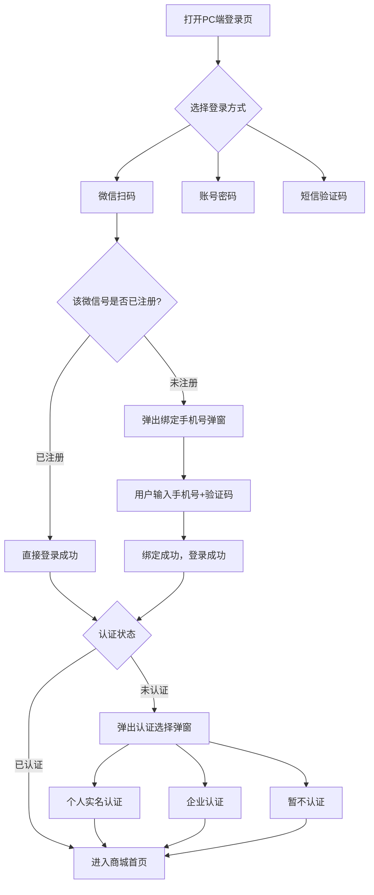
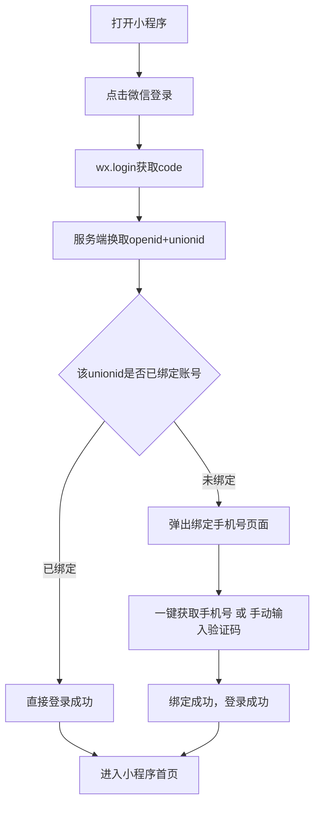
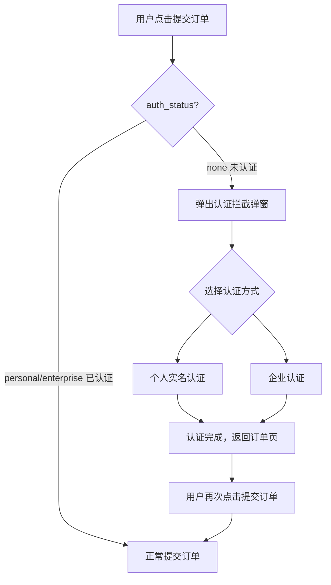

# 微信登录 & 企业认证 PRD v2.0（PC端 + 小程序端）

---

## 一、需求背景

**项目目标**：通过微信登录降低注册门槛，提升用户转化率。同时引导用户完成实名认证，支持PC端和小程序端多端账号打通。

**核心业务流程**：
1. 用户通过微信扫码或授权完成登录（PC端/小程序端）
2. 首次微信登录的用户需要绑定手机号完成注册（登录即注册）
3. 登录后引导用户选择是否进行实名认证（认证不强制，但下单前必须完成）
4. 同一微信号在PC端和小程序端登录时，自动关联到同一账号（多端账号打通）

---

## 二、支持的登录方式

| 终端 | 登录方式 | 说明 |
|------|---------|------|
| PC端 | 微信扫码登录 | 展示二维码，用户用微信扫码授权（主要登录方式） |
| PC端 | 微信一键登录 | 点击按钮跳转微信授权页（移动端H5使用） |
| PC端 | 账号密码登录 | 传统方式，邮箱/手机号 + 密码 |
| PC端 | 短信验证码登录 | 手机号 + 验证码 |
| 小程序端 | 微信授权登录 | 点击按钮，wx.login获取code完成登录 |
| 小程序端 | 账号密码登录 | 手机号+密码登录 |
| 小程序端 | 手机号授权/手动登录 | 一键获取微信手机号，或手动输入手机号+验证码 |

---

## 三、核心业务流程

### 3.1 PC端登录流程

### 3.2 小程序登录流程

### 3.3 下单认证拦截流程

---

## 四、功能清单

### 4.1 登录模块

| 功能 | 说明 | 优先级 |
|------|------|:------:|
| PC端-扫码登录Tab | 展示180×180px微信二维码，5分钟有效期，过期显示刷新按钮 | P0 |
| PC端-密码登录Tab | 账号+密码登录，支持30天免登录，忘记密码链接 | P0 |
| PC端-验证码登录Tab | 手机号+验证码，60秒倒计时获取验证码 | P0 |
| PC端-微信一键登录 | 扫码Tab下方"微信快捷登录"按钮，点击弹出确认弹窗后跳转授权 | P0 |
| PC端-次要登录图标 | 扫码Tab底部：验证码登录图标 + 密码登录图标；密码Tab底部：验证码登录图标 + 微信扫码图标；验证码Tab底部：密码登录图标 + 微信扫码图标。点击可切换，内容不清空。 | P1 |
| 小程序端-微信授权登录 | wx.login获取code，服务端换取openid+unionid完成登录 | P0 |
| 小程序端-账号密码登录 | 手机号+密码登录 | P0 |
| 小程序端-手机号绑定 | 首次登录弹出，一键获取微信手机号授权 或 手动输入手机号+验证码 | P0 |

### 4.2 认证模块

| 功能 | 说明 | 优先级 |
|------|------|:------:|
| 登录后认证选择弹窗 | 新用户登录成功后自动弹出（仅首次），可选择个人认证/企业认证/暂不认证 | P1 |
| 下单认证拦截 | 用户点击提交订单时检查认证状态，未认证弹出拦截弹窗 | P0 |
| 买家中心实名认证入口 | 买家中心侧边栏【实名认证】入口，未认证显示红色提示，已认证显示绿色✅ | P1 |

---

## 五、认证选择弹窗详细说明

### 5.1 触发条件

- 新用户（认证状态=none）登录成功后自动弹出
- 已认证用户（personal/enterprise）登录不再弹出

### 5.2 弹窗选项

| 选项 | 说明 | 用户收益 |
|------|------|---------|
| 👤 个人实名认证 | 快速认证，只需姓名+身份证号 | 适合个人采购，认证即时生效 |
| 🏢 企业认证（推荐） | 企业信息+营业执照，e签宝认证 | 认证后享企业专属价与开票资格 |
| 暂不认证 | 关闭弹窗，可正常浏览商城 | 下单前仍需认证 |

### 5.3 交互规则

- 仅首次登录弹出一次，之后不再弹出
- 选择"暂不认证"可关闭弹窗，正常使用
- 选择认证后跳转到对应认证流程，完成后进入首页

---

## 六、认证状态与权限

| 认证状态 | 说明 | 可下单 | 企业专属价 | 可升级 |
|---------|------|:------:|:---------:|:------:|
| 未认证（none） | 刚注册的用户 | ❌ 需先认证 | ❌ | ✅ |
| 个人认证（personal） | 已完成个人实名认证 | ✅ | ❌ | ✅ |
| 企业认证（enterprise） | 已完成企业认证 | ✅ | ✅ | ❌ |

**认证可升级不可降级**：个人认证可升级为企业认证，企业认证后不可降级为个人认证。

---

## 七、关键业务规则

| 规则 | 说明 |
|------|------|
| **登录即注册** | 首次微信登录时，系统无该用户记录，需要绑定手机号完成注册。绑定后该微信号与手机号关联，后续微信登录直接成功。 |
| **认证不强制，下单必须** | 用户登录后可选择"暂不认证"跳过，但提交订单前必须完成认证（个人或企业）。 |
| **多端账号打通** | PC端和小程序端通过unionid识别同一用户。同一微信号在两端登录时，自动关联到同一个账号，无需重复绑定。 |
| **手机号唯一绑定** | 同一手机号不可重复绑定不同微信号。如遇已绑定情况，提示用户联系客服。 |

---

## 八、异常场景处理

| 场景 | 处理方式 |
|------|---------|
| 微信服务不可用 | 引导用户使用账号密码或短信验证码登录 |
| 用户未关注公众号，unionid为空 | 以openid作为该端唯一标识，多端打通功能暂不可用 |
| 同一微信号绑定不同手机号 | 拒绝绑定，提示"该微信号已绑定其他手机号，请联系客服" |

---

## 九、验收标准

| 功能 | 验收标准 |
|------|---------|
| PC端微信扫码登录 | 二维码正常显示，扫码后老用户直接登录，新用户跳转绑定手机号流程 |
| PC端微信一键登录 | 点击按钮弹出确认弹窗，确认后跳转微信授权页，授权完成正确登录 |
| PC端账号密码登录 | 账号密码正确可登录，错误提示登录失败，30天免登录正常 |
| PC端短信验证码登录 | 手机号格式正确+验证码正确可登录，60秒倒计时正常 |
| PC端次要登录图标 | 各Tab底部正确显示其他两种登录方式图标，点击可切换且内容不清空 |
| 小程序微信授权登录 | wx.login成功，服务端换取openid/unionid，老用户直接登录，新用户弹出绑定手机号 |
| 登录后认证弹窗 | 新用户登录成功后自动弹出，已认证用户登录不再弹出，选择"暂不认证"可关闭 |
| 下单认证拦截 | 未认证用户点击提交订单被拦截并弹窗引导认证，已认证用户正常提交订单 |
| 认证完成回跳 | 认证完成后返回订单确认页，用户需再次点击提交（不自动提交） |
| 买家中心认证入口 | 未认证用户显示红色提示标识，点击跳转认证选择页；已认证用户显示绿色✅标识 |
| 多端账号打通 | 同一微信号在PC端和小程序端分别登录，两端登录到同一个账号（user_id相同） |

---

## 十、原型说明

| 原型 | 说明 |
|------|------|
| PC端原型 | `原型_登录页_最终版.html` - 包含8个演示状态：默认登录页、微信授权确认弹窗、绑定手机号弹窗、登录成功、老用户直接登录、二维码过期刷新、认证选择弹窗、下单认证拦截弹窗 |
| 小程序端原型 | `https://u.pmdaniu.com/zvz87` - Axure设计稿，包含微信授权登录、手机号绑定、认证流程等完整页面 |

---

## 版本

| 版本 | 日期 | 变更说明 |
|------|------|---------|
| v1.0 | 2026-04-21 | 初始版本 |
| v2.0 | 2026-05-06 | 精简结构，突出业务逻辑，补充详细说明便于理解 |