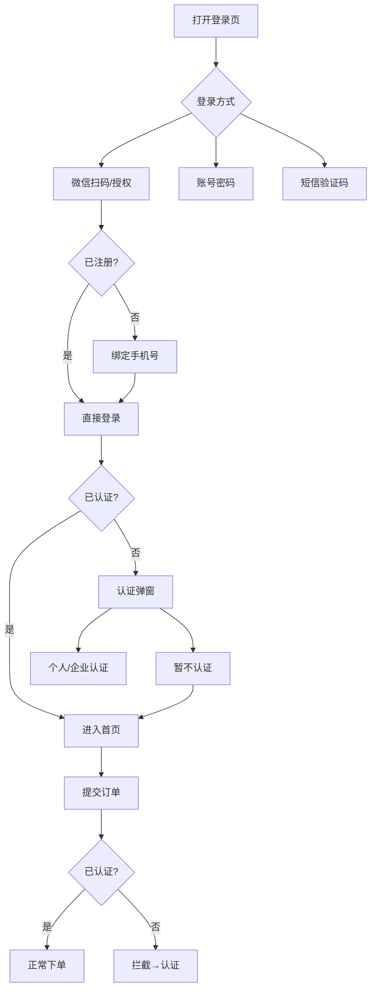

# 微信登录 & 企业认证 PRD v2.0（PC端 + 小程序端）

> **项目概括**：微信扫码/授权登录 → 登录即注册 → 认证引导（不强制）→ 下单前必须认证 → 多端账号打通

---

## 一、需求背景

通过微信登录降低注册门槛，提升转化率。登录后引导实名认证，**认证不强制但下单前必须完成**。

---

## 二、核心业务流程

---

## 三、功能清单

| 终端 | 功能 | 优先级 | 说明 |
|------|------|:------:|------|
| **登录方式** |
| PC端 | 微信扫码登录 | P0 | 展示二维码，扫码授权 |
| PC端 | 微信一键登录 | P0 | H5端点击按钮跳转授权页 |
| PC端 | 账号密码登录 | P0 | 邮箱/手机号 + 密码 |
| PC端 | 短信验证码登录 | P0 | 手机号 + 验证码 |
| 小程序端 | 微信授权登录 | P0 | wx.login获取code完成登录 |
| 小程序端 | 手机号绑定 | P0 | 一键获取手机号或手动输入 |
| **认证流程** |
| 全局 | 登录后认证选择弹窗 | P1 | 个人认证/企业认证/暂不认证 |
| 全局 | 下单认证拦截 | P0 | 未认证用户下单前拦截 |
| 买家中心 | 实名认证入口 | P1 | 随时可主动发起认证 |

---

## 四、关键业务规则

| 规则 | 说明 |
|------|------|
| 登录即注册 | 首次微信登录绑定手机号后自动创建账号 |
| 认证不强制，下单必须 | 登录后可跳过认证，但提交订单前必须完成认证 |
| 认证可升级不可降级 | 个人认证可升级为企业认证，企业认证不可降级为个人 |
| 多端账号打通 | 同一微信号在PC端和小程序端登录到同一账号 |

---

## 五、认证状态说明

| 状态 | 说明 | 可操作 |
|------|------|--------|
| 未认证（none） | 刚注册的用户 | 可跳过认证浏览，下单前必须认证 |
| 个人认证（personal） | 已完成个人实名 | 可升级为企业认证 |
| 企业认证（enterprise） | 已完成企业认证 | 不可降级，享企业专属价 |

### 认证触发场景

| 场景 | 触发条件 | 用户操作 |
|------|---------|---------|
| 登录后弹窗 | 新用户登录成功，认证状态=none | 选择个人/企业认证，或暂不认证 |
| 下单拦截 | 用户点击提交订单，认证状态=none | 必须完成认证才能下单 |
| 手动认证 | 买家中心【实名认证】入口 | 随时可主动发起认证 |

---

## 六、原型说明

| 原型 | 说明 |
|------|------|
| PC端原型 | `pc-prototype.html` - 扫码登录、绑定手机号、认证弹窗、下单拦截 |
| 小程序端 | `https://u.pmdaniu.com/zvz87` - Axure设计稿 |

---

## 七、验收标准

| 验收项 | 预期结果 |
|--------|---------|
| PC端微信扫码登录 | 老用户直接登录，新用户跳转绑定手机号 |
| PC端微信一键登录 | 确认弹窗 → 跳转授权页 → 正确登录 |
| 小程序微信登录 | 老用户直接进入，新用户弹出绑定手机号 |
| 登录后认证弹窗 | 新用户登录后弹出，已认证用户不再弹出 |
| 暂不认证可关闭 | 选择"暂不认证"可关闭弹窗，正常浏览商城 |
| 下单认证拦截 | 未认证用户点击提交订单被拦截，已认证用户正常提交 |
| 多端账号打通 | 同一微信号在PC端和小程序端登录到同一账号 |

---

## 版本

| 版本 | 日期 | 变更 |
|------|------|------|
| v1.0 | 2026-04-21 | 初始版本 |
| v2.0 | 2026-05-06 | 精简结构，突出业务逻辑，去除技术细节 |