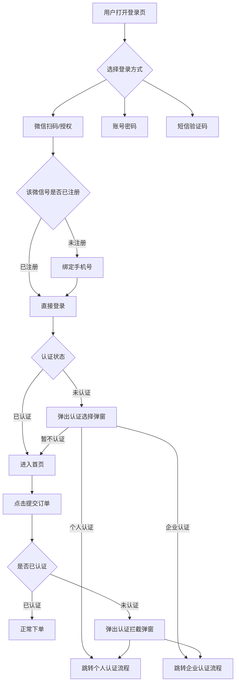

# 微信登录功能 PRD（PC端 + 小程序端）

---

## 一、需求背景与目标

### 1.1 需求背景

通过微信登录降低注册门槛，提升用户转化率。登录后引导实名认证，**认证不强制但下单前必须完成**。

### 1.2 需求目标

| 优先级 | 目标 | 说明 |
|:------:|------|------|
| P0 | 微信登录 | PC扫码 + 小程序授权，支持多端账号打通 |
| P0 | 登录即注册 | 首次微信登录绑定手机号完成注册 |
| P0 | 下单前认证拦截 | 未认证用户下单前必须完成认证 |
| P1 | 认证引导弹窗 | 登录后引导选择个人/企业认证，可跳过 |
| P1 | 多端账号打通 | PC端和小程序端通过unionid识别同一用户 |

---

## 二、核心业务流程



---

## 三、功能清单总览

| 终端 | 功能 | 优先级 | 说明 |
|------|------|:------:|------|
| **登录模块** |
| PC端 | 微信扫码登录 | P0 | 展示二维码，扫码授权 |
| PC端 | 微信一键登录 | P0 | H5端点击按钮跳转授权页 |
| PC端 | 账号密码登录 | P0 | 邮箱/手机号 + 密码 |
| PC端 | 短信验证码登录 | P0 | 手机号 + 验证码（60s倒计时） |
| PC端 | 次要登录图标 | P1 | 每个Tab底部显示其他登录方式图标 |
| 小程序端 | 微信授权登录 | P0 | wx.login获取code完成登录 |
| 小程序端 | 手机号授权登录 | P0 | 一键获取手机号或手动输入 |
| **认证模块** |
| 全局 | 登录后认证选择弹窗 | P1 | 个人认证/企业认证/暂不认证 |
| 全局 | 下单认证拦截 | P0 | 未认证用户下单前拦截 |
| 买家中心 | 实名认证入口 | P1 | 随时可主动发起认证 |

---

## 四、功能详细说明

### 4.1 PC端——登录页

#### 4.1.1 微信扫码登录

**登录流程**：
```
展示二维码（5分钟有效期）
    ↓
用户扫码并确认
    ↓
服务端通过code换取openid + unionid
    ↓
┌─ 已绑定账号 → 直接登录成功
└─ 未绑定账号 → 弹出绑定手机号弹窗 → 绑定成功后登录
```

**验收标准**：
- 🎯 二维码正常展示，5分钟过期显示刷新按钮
- 🎯 已注册微信号扫码直接登录
- 🎯 未注册微信号扫码弹出绑定手机号弹窗

#### 4.1.2 微信一键登录

点击"微信快捷登录"按钮 → 弹出确认弹窗 → 用户确认 → 跳转微信授权页 → 授权回调完成登录。

**验收标准**：
- 🎯 点击按钮弹出确认弹窗
- 🎯 确认后跳转微信授权页

#### 4.1.3 账号密码登录 / 短信验证码登录

标准表单登录，支持30天免登录。

---

### 4.2 小程序端——登录页

**微信授权登录流程**：
```
点击微信登录按钮
    ↓
wx.login() 获取 code
    ↓
服务端用 code 换取 openid + unionid
    ↓
┌─ unionid已绑定账号 → 直接登录成功
└─ unionid未绑定 → 弹出手机号绑定页面
        ↓
    用户一键获取手机号或手动输入验证码
        ↓
    绑定成功，登录成功
```

**验收标准**：
- 🎯 微信登录成功，老用户直接进入
- 🎯 新用户弹出手机号绑定页面

---

### 4.3 认证选择弹窗（登录后）

**触发时机**：用户登录成功，认证状态为"未认证"时自动弹出

**弹窗选项**：
| 选项 | 说明 |
|------|------|
| 👤 个人实名认证 | 快速认证，适合个人采购 |
| 🏢 企业认证 | 认证后享企业专属价与开票（推荐） |
| 暂不认证 | 可关闭弹窗正常浏览，下单前仍需认证 |

**交互规则**：
- 仅首次登录弹出，已认证用户不再弹出
- 选择"暂不认证"可关闭，正常使用
- 选择认证后跳转到对应认证流程

**验收标准**：
- 🎯 新用户登录成功后自动弹出
- 🎯 已认证用户登录不再弹出
- 🎯 选择"暂不认证"可关闭，正常浏览

---

### 4.4 下单认证拦截

**触发时机**：用户点击"提交订单"时

**拦截逻辑**：
```
用户点击提交订单
    ↓
检查 auth_status
    ↓
┌─ 已认证（personal/enterprise）→ 正常提交订单
└─ 未认证（none）→ 弹出认证拦截弹窗
        ↓
    用户选择认证方式 → 完成认证 → 返回订单页
        ↓
    用户再次点击提交订单 → 正常提交
```

**验收标准**：
- 🎯 未认证用户点击提交订单被拦截
- 🎯 已认证用户正常提交订单
- 🎯 完成认证后返回订单页，用户手动提交

---

### 4.5 买家中心——实名认证入口

**入口位置**：买家中心侧边栏 / 个人中心 → 【实名认证】

**状态显示**：
| 认证状态 | 显示 |
|---------|------|
| 未认证 | 红色提示标识，点击跳转认证选择 |
| 个人已认证 | 绿色✅ + "个人认证"，可升级为企业认证 |
| 企业已认证 | 绿色✅ + "企业认证"，可查看认证信息 |

**验收标准**：
- 🎯 未认证用户看到红色提示标识
- 🎯 已认证用户看到绿色✅标识

---

## 五、数据表改造

### 5.1 用户表新增字段

| 字段 | 类型 | 说明 |
|------|------|------|
| auth_status | varchar(20) | 认证状态：none / personal / enterprise |
| auth_time | datetime | 最近一次认证通过时间 |

### 5.2 微信登录表（wechat_auth）

| 字段 | 类型 | 说明 |
|------|------|------|
| id | bigint | 主键 |
| user_id | bigint | 关联用户ID（绑定后写入） |
| openid | varchar(50) | 微信openid |
| unionid | varchar(50) | 微信unionid（多端打通） |
| platform | varchar(20) | pc_web / miniapp |
| nickname | varchar(50) | 微信昵称 |
| avatar_url | varchar(200) | 微信头像 |
| created_at | datetime | 创建时间 |
| updated_at | datetime | 更新时间 |

**索引**：`UNIQUE uk_openid_platform(openid, platform)` + `INDEX idx_unionid(unionid)`

---

## 六、关键业务规则

| 规则 | 说明 |
|------|------|
| 多端身份打通 | 同一unionid在PC端和小程序端关联到同一user_id |
| 登录即注册 | 首次微信登录绑定手机号后自动创建账号 |
| 认证不强制，下单必须 | 登录后可跳过认证，但提交订单前必须完成认证 |
| 认证可升级不可降级 | 个人认证可升级为企业认证，企业认证不可降级为个人认证 |

---

## 七、异常场景处理

| 场景 | 处理方式 |
|------|---------|
| 微信服务不可用 | 引导使用账号密码或短信验证码登录 |
| unionid为空 | 以openid作为该端唯一标识，多端打通功能降级 |
| 同一微信号绑定不同手机号 | 拒绝绑定，提示"该微信号已绑定其他手机号" |

---

## 八、验收标准汇总

### 8.1 登录功能验收

| 验收项 | 标准 |
|--------|------|
| PC端扫码登录 | 二维码正常显示，扫码后老用户直接登录，新用户跳转绑定手机号 |
| PC端微信一键登录 | 弹出确认弹窗，确认后跳转授权页，授权后正确登录 |
| 小程序微信登录 | wx.login成功，服务端换取openid/unionid，正确登录 |
| 多端账号打通 | 同一微信号在PC端和小程序端登录到同一账号 |

### 8.2 认证功能验收

| 验收项 | 标准 |
|--------|------|
| 认证弹窗触发 | 新用户登录成功后弹出，已认证用户不再弹出 |
| 认证弹窗可跳过 | 选择"暂不认证"可关闭，正常浏览 |
| 下单认证拦截 | 未认证用户提交订单被拦截，引导去认证 |
| 认证完成回跳 | 认证完成后返回订单确认页，用户手动提交 |
| 买家中心入口 | 随时可主动发起认证，已认证可查看信息 |

---

## 九、原型说明

| 原型 | 位置 | 说明 |
|------|------|------|
| PC端登录页原型 | `pc-prototype.html` | 包含8个演示状态：扫码登录、绑定手机号、认证选择弹窗、下单拦截等 |
| 小程序端原型 | `https://u.pmdaniu.com/zvz87` | Axure设计稿，包含微信授权登录、手机号绑定、认证流程 |

---

## 十、文档版本

| 版本 | 日期 | 变更说明 |
|------|------|---------|
| v1.0 | 2026-04-21 | 初始版本 |
| v1.11 | 2026-05-05 | 新增登录后认证引导 + 下单认证拦截 + 多端账号打通 |