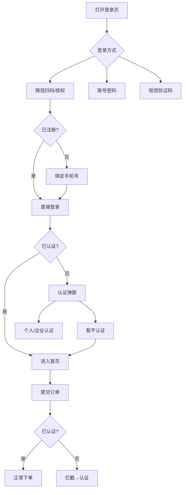

# 微信登录 & 企业认证 PRD v2.0（PC端 + 小程序端）

> **项目概括**：微信扫码/授权登录 → 登录即注册 → 认证引导（不强制）→ 下单前必须认证 → 多端账号打通

---

## 一、需求背景与目标

**背景**：通过微信登录降低注册门槛，提升转化率。登录后引导实名认证，**认证不强制但下单前必须完成**。

**目标**：
| 优先级 | 目标 |
|:------:|------|
| P0 | 微信登录（PC扫码 + 小程序授权） |
| P0 | 登录即注册（首次微信登录绑定手机号） |
| P0 | 下单前认证拦截（未认证不能下单） |
| P1 | 认证引导弹窗（登录后可跳过） |
| P1 | 多端账号打通（PC端和小程序端同一用户） |

---

## 二、核心业务流程

---

## 三、功能清单

| 终端 | 功能 | 优先级 |
|------|------|:------:|
| **登录** |
| PC端 | 微信扫码登录 | P0 |
| PC端 | 微信一键登录 | P0 |
| PC端 | 账号密码 / 短信验证码登录 | P0 |
| 小程序端 | 微信授权登录 + 手机号绑定 | P0 |
| **认证** |
| 全局 | 登录后认证选择弹窗（个人/企业/暂不认证） | P1 |
| 全局 | 下单认证拦截 | P0 |
| 买家中心 | 实名认证入口（随时可主动认证） | P1 |

---

## 四、关键业务规则

| 规则 | 说明 |
|------|------|
| 登录即注册 | 首次微信登录绑定手机号后自动创建账号 |
| 认证不强制，下单必须 | 登录后可跳过认证，但提交订单前必须完成认证 |
| 认证可升级不可降级 | 个人认证可升级为企业认证，企业认证不可降级 |
| 多端账号打通 | 同一unionid在PC端和小程序端关联到同一user_id |

---

## 五、数据表改造

| 表 | 字段 | 说明 |
|---|------|------|
| 用户表 | auth_status | 认证状态：none / personal / enterprise |
| 用户表 | auth_time | 最近认证通过时间 |
| wechat_auth | openid + platform | 联合唯一索引 |
| wechat_auth | unionid | 普通索引（多端打通） |

---

## 六、开发重点注意事项

### ⚠️ 阻塞项（开发前必须确认）

| 事项 | 后果 |
|------|------|
| PC端网站应用 + 小程序必须绑定到**同一微信开放平台主体账号** | unionid不一致，多端无法打通 |
| 登录时**必须同时存储 openid + unionid** | 后上线端无法打通 |
| PC端需配置授权回调域 + HTTPS证书 | 二维码无法回调 |
| wechat_auth表第一期必须建好（含platform、unionid字段） | 后期数据混乱 |

### 核心逻辑

| 模块 | 实现要点 |
|------|---------|
| 二维码 | 微信开放平台接口生成，5分钟有效期，过期刷新 |
| 登录绑定 | unionid无账号 → 弹窗绑定手机号 → 关联用户 |
| 认证判断 | auth_status = none → 弹窗引导 / personal/enterprise → 放行 |
| 下单拦截 | 提交订单前检查auth_status，未认证弹窗拦截 |

---

## 七、验收标准

| 验收项 | 标准 |
|--------|------|
| 微信扫码登录 | 老用户直接登录，新用户跳转绑定手机号 |
| 微信一键登录 | 确认弹窗 → 跳转授权页 → 正确登录 |
| 小程序登录 | wx.login成功，老用户直接进，新用户绑定手机号 |
| 认证弹窗 | 新用户登录后弹出，已认证用户不再弹出 |
| 认证可跳过 | 选择"暂不认证"可关闭，正常浏览 |
| 下单拦截 | 未认证用户点击提交订单被拦截 |
| 多端打通 | 同一微信号在PC端和小程序端登录到同一账号 |

---

## 八、原型说明

| 原型 | 说明 |
|------|------|
| PC端原型 | `pc-prototype.html` - 8个演示状态 |
| 小程序端 | `https://u.pmdaniu.com/zvz87` - Axure设计稿 |

---

## 版本

| 版本 | 日期 | 变更 |
|------|------|------|
| v1.0 | 2026-04-21 | 初始版本 |
| v2.0 | 2026-05-06 | 精简结构，突出核心逻辑，补充开发注意事项 |