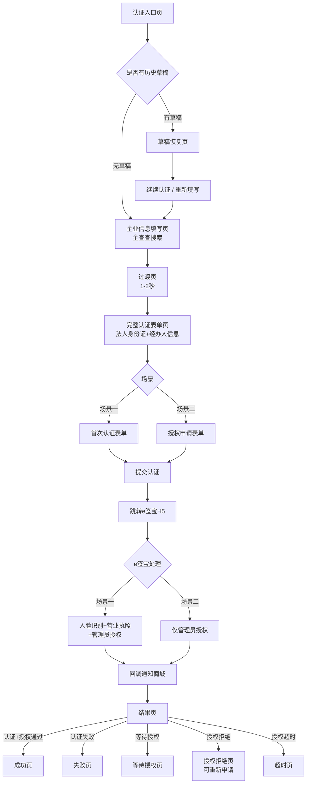

# 企业认证功能 PRD v1.0

**版本**：v1.0
**更新**：2026-05-05
**关联原型**：PC端 v7.5 · 小程序端 v7.5

---

## 一、需求背景

本功能基于 e 签宝实现企业实名认证和授权。商城侧**不区分场景**，统一展示表单，**后端判断场景**后传参给 e 签宝，e 签宝 H5 根据后端参数自动适配首次认证/已认证授权流程。

**当前业务流程**：
```
用户 → 物料商城 → 企业认证 → e签宝
```

---

## 二、需求目标

| 目标 | 说明 |
|------|------|
| 核心目标 | 实现企业实名认证和电子合同授权功能 |
| 业务价值 | 企业认证后可使用账期支付、签署电子合同 |
| 关键约束 | 认证和授权必须通过 e 签宝完成 |

---

## 三、需求核心业务流程图

### 3.1 用户端业务流程



### 3.2 场景差异说明

| 对比项 | 场景一（首次认证） | 场景二（已认证授权） |
|--------|-------------------|-------------------|
| 触发条件 | 企业未在e签宝认证过 | 企业已在e签宝认证过 |
| 表单差异 | 需填写法人身份证号 | 法人身份证号自动回填（只读） |
| e签宝流程 | 人脸识别+营业执照+授权 | 仅授权 |
| 认证时长 | 5-10分钟 | 1-2分钟 |

---

## 四、需求功能清单

| 终端 | 模块 | 功能 | 描述 |
|------|------|------|------|
| PC/小程序 | 企业认证 | 认证入口页 | 权益引导，未认证用户进入认证流程 |
| PC/小程序 | 企业认证 | 草稿恢复页 | 检测历史草稿，可继续或重新填写 |
| PC/小程序 | 企业认证 | 企业信息填写 | 企查查搜索，自动填充企业信息 |
| PC/小程序 | 企业认证 | 过渡页 | 纯前端1-2秒，不调接口 |
| PC/小程序 | 企业认证 | 首次认证表单 | 场景一：含法人身份证填写 |
| PC/小程序 | 企业认证 | 授权申请表单 | 场景二：仅授权申请 |
| PC/小程序 | 企业认证 | 结果页 | 认证成功/失败/等待授权/授权拒绝 |
| 后端 | 认证服务 | 场景判断 | 后端查auth_status判断场景一/二 |
| 后端 | 认证服务 | e签宝对接 | 调用e签宝接口获取认证链接 |
| 后端 | 认证服务 | 回调处理 | 更新认证状态 |

---

## 五、需求功能详述

---

### 5.1 PC端/小程序端——企业认证——认证入口页

**原型描述**：
- 权益引导页，展示认证价值和当前状态
- 未认证显示【去认证】按钮，已认证显示认证状态

**用户故事**：
> 作为一个**未认证企业用户**，我想要**了解认证价值和流程**，以便于**决定是否进行认证**。

**前置条件**：
- 用户已登录

**核心逻辑**：
- 检查企业认证状态
- 有草稿则显示【继续认证】按钮
- 无草稿则显示【去认证】按钮

**边界条件与异常处理**：
- 已认证通过：显示认证成功状态
- 已认证待授权：显示等待授权状态
- 有草稿：允许恢复或重新填写

**验收标准**：
- ✅ 用户能看到认证价值说明
- ✅ 未认证用户能看到【去认证】入口
- ✅ 已认证用户能看到当前认证状态

**测试用例**：
- 未认证用户看到【去认证】按钮
- 已认证用户看到认证状态
- 有草稿时看到【继续认证】按钮

---

### 5.2 PC端/小程序端——企业认证——草稿恢复页

**原型描述**：
- 检测到历史草稿时显示
- 提供【继续认证】和【重新填写】两个选项

**用户故事**：
> 作为一个**有历史草稿的企业用户**，我想要**快速恢复之前的填写进度**，以便于**节省时间**。

**前置条件**：
- 用户有未提交的认证草稿

**核心逻辑**：
- 点【继续认证】：回填草稿数据，继续填写流程
- 点【重新填写】：清除草稿，重新开始

**验收标准**：
- ✅ 正确显示草稿创建时间
- ✅ 继续认证能回填之前数据
- ✅ 重新填写能清空草稿

---

### 5.3 PC端/小程序端——企业认证——企业信息填写页

**原型描述**：
- 企查查搜索框，输入≥2字触发模糊搜索
- 选中企业后自动填充：企业名称、统一社会信用代码、法定代表人姓名、注册地址

**用户故事**：
> 作为一个**企业用户**，我想要**快速填写企业信息**，以便于**减少手动输入**。

**前置条件**：
- 用户点击【去认证】或【继续认证】

**核心逻辑**：
- 企查查搜索返回企业列表
- 选中后自动填充4个字段
- 点击【下一步】进入过渡页

**边界条件与异常处理**：
- 搜索无结果：提示"未找到企业，请手动输入"
- 企业信息填写不完整：【下一步】按钮禁用

**验收标准**：
- ✅ 输入≥2字触发搜索
- ✅ 选中企业后自动填充4个字段
- ✅ 点击【下一步】进入过渡页

**测试用例**：
- 输入1字不触发搜索
- 输入2字触发搜索
- 选中企业自动填充字段
- 信息不完整时【下一步】禁用

---

### 5.4 PC端/小程序端——企业认证——过渡页

**原型描述**：
- 显示"正在准备认证材料..."加载动画
- 纯前端setTimeout 1-2秒，不调接口
- 自动跳转到完整认证表单页

**用户故事**：
> 作为一个**企业用户**，我想要**等待认证材料准备**，以便于**看到完整表单**。

**前置条件**：
- 企业信息已填写并提交

**核心逻辑**：
- 纯前端展示加载动画
- setTimeout 1-2秒后自动跳转
- 不调用任何后端接口

**验收标准**：
- ✅ 显示加载动画
- ✅ 1-2秒后自动跳转
- ✅ 不调接口

---

### 5.5 PC端/小程序端——企业认证——首次认证表单（场景一）

**原型描述**：
- 表单包含：法人身份证号 + 经办人（姓名/身份证/接收订单消息电话）
- 选填：经营类型/公司电话/邮箱
- 必勾：同意协议

**用户故事**：
> 作为一个**首次认证的企业用户**，我想要**填写认证信息**，以便于**完成e签宝实名认证**。

**前置条件**：
- 通过过渡页
- 后端判断为场景一（企业未认证过）

**核心逻辑**：
- 需填写法人身份证号
- 提交后获取authUrl，跳转e签宝H5

**边界条件与异常处理**：
- 法人身份证格式错误：表单验证不通过
- 协议未勾选：提交按钮禁用

**验收标准**：
- ✅ 法人身份证号必填
- ✅ 表单验证通过后提交
- ✅ 提交后跳转e签宝H5

---

### 5.6 PC端/小程序端——企业认证——授权申请表单（场景二）

**原型描述**：
- 企业信息（只读）
- 法人身份证号（自动回填，只读）
- 申请人信息：姓名/手机/申请理由
- 必勾：同意协议

**用户故事**：
> 作为一个**已完成认证的企业用户**，我想要**申请电子合同授权**，以便于**使用账期支付功能**。

**前置条件**：
- 通过过渡页
- 后端判断为场景二（企业已认证）

**核心逻辑**：
- 法人身份证号由后端回填，前端只读
- 提交后获取authUrl，跳转e签宝授权页

**边界条件与异常处理**：
- 授权申请最多3次，第4次返回错误

**验收标准**：
- ✅ 法人身份证号自动回填且只读
- ✅ 提交后跳转e签宝授权页
- ✅ 第4次提交返回错误提示

---

### 5.7 后端——认证服务——场景判断

**原型描述**：
- 后端查询企业认证状态 auth_status
- UNVERIFIED(0) → 场景一（首次认证）
- 其他状态 → 场景二（已认证授权）

**前置条件**：
- 用户提交表单

**核心逻辑**：
- auth_status = UNVERIFIED → 场景一
- auth_status ≠ UNVERIFIED → 场景二

---

### 5.8 后端——认证服务——回调通知

**原型描述**：
- 接收 e 签宝回调通知
- 更新认证状态
- 返回结果页

**前置条件**：
- e签宝认证/授权完成

**核心逻辑**：
1. 接收回调通知
2. 更新认证状态
3. 通知前端刷新状态

---

## 六、关键注意点（D1-D14）

> **开发前必读，以下注意点决定了功能是否正确实现**

| # | 注意点 | 说明 |
|---|--------|------|
| D1 | 后端判断场景，前端统一表单 | 场景判断在后端，不在前端 |
| D2 | transactorInfo 场景差异 | 场景一传，场景二不传 |
| D3 | 草稿永久保存 | 任何环节可保存，后续继续 |
| D4 | 认证失败可重新认证 | 数据回填，直接修改 |
| D5 | 授权重试最多3次 | 第4次返回400错误 |
| D6 | 授权超时24小时 | 超时自动失效，需重新申请 |
| D7 | 小程序redirectUrl | 需指向中间H5页 |
| D8 | clientType传值 | 小程序必须传 MINI_APP |
| D9 | 业务域名配置 | 微信公众平台配置 openapi.esign.cn |
| D10 | X-Platform头 | 小程序必须传 X-Platform: miniapp |
| D11 | 场景二法人身份证回填 | 后端自动回填，前端只读 |
| D12 | 过渡页纯前端 | 1-2秒setTimeout，不调接口 |
| D13 | 草稿自动保存 | 每30秒+页面失焦时自动保存 |
| D14 | 协议必勾 | 未勾选时提交按钮禁用 |

---

## 七、边界条件与异常处理

| 场景 | 条件 | 处理方式 |
|------|------|---------|
| 草稿保存 | 任何环节 | 自动每30秒保存 + 页面失焦保存 |
| 草稿有效期 | 永久 | 永久保存，90天未更新自动清理 |
| 授权重试 | 最多3次 | 第4次提交返回400 |
| 授权超时 | 24小时 | 超时自动失效，需重新申请 |
| 认证失败 | 可重新认证 | 点【重新认证】跳转表单并回填数据 |
| 场景二表单 | 法人身份证 | 后端自动回填，前端只读 |

---

## 八、验收标准

### 8.1 状态机

| 状态值 | 状态名 | 含义 |
|--------|--------|------|
| UNVERIFIED (0) | 未认证 | 初始状态 |
| DRAFT (1) | 草稿 | 有未完成认证 |
| VERIFYING (2) | 认证中 | 已提交等待回调 |
| REJECTED (4) | 认证失败 | 可重新认证 |
| AUTHZ_PENDING (5) | 授权待处理 | 等待管理员审批 |
| AUTHZ_APPROVED (6) | 授权通过 | 可签合同 |
| AUTHZ_REJECTED (7) | 授权拒绝 | 可重新申请 |

### 8.2 成功场景

| # | 场景 | 预期结果 |
|---|------|---------|
| 1 | 场景一完整流程 | 表单→过渡页→e签宝H5→人脸+营业执照+授权→成功 |
| 2 | 场景二完整流程 | 表单→过渡页→e签宝H5→仅授权→成功 |
| 3 | 草稿恢复 | 继续认证回填之前数据 |

### 8.3 失败场景

| # | 场景 | 预期结果 |
|---|------|---------|
| 1 | 认证失败 | 显示失败原因，可重新认证 |
| 2 | 授权拒绝 | 显示拒绝原因，可重新申请（最多3次） |
| 3 | 授权超时 | 提示超时，需重新申请 |

### 8.4 边界场景

| # | 场景 | 预期结果 |
|---|------|---------|
| 1 | 法人身份证格式错误 | 表单验证不通过，提示格式错误 |
| 2 | 协议未勾选 | 提交按钮禁用 |
| 3 | 网络超时 | 提示重试，数据不丢失 |

---

## 九、附录

### 9.1 参考文档

| 文档 | 链接 |
|------|------|
| PC端原型 | https://connie-316.github.io/enterprise-auth-docs/pc-prototype.html |
| 小程序端原型 | https://connie-316.github.io/enterprise-auth-docs/mini-prototype.html |

### 9.2 更新记录

| 版本 | 日期 | 修改内容 |
|------|------|---------|
| v1.0 | 2026-05-05 | 按PRD模板规范重写，流程图聚焦用户视角页面流程 |

---

**文档状态**：已完成
**下次更新**：如有需求变更