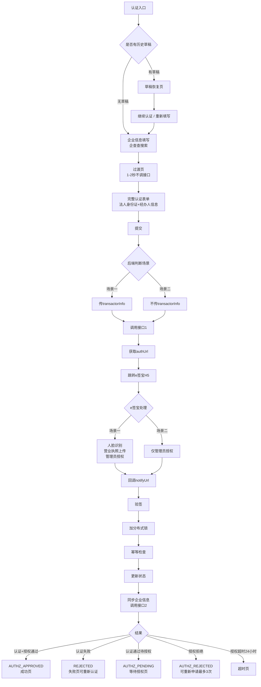

# 企业认证功能 PRD v1.0

**版本**：v1.0
**更新**：2026-05-05
**关联原型**：PC端 v7.5 · 小程序端 v7.5

---

## 一、需求背景

本功能基于 e 签宝实现企业实名认证和授权。商城侧**不区分场景**，统一展示表单，**后端判断场景**后传参给 e 签宝，e 签宝 H5 根据后端参数自动适配首次认证/已认证授权流程。

**当前业务流程**：
```
用户 → 物料商城 → 企业认证 → e签宝
```

---

## 二、需求目标

| 目标 | 说明 |
|------|------|
| 核心目标 | 实现企业实名认证和电子合同授权功能 |
| 业务价值 | 企业认证后可使用账期支付、签署电子合同 |
| 关键约束 | 认证和授权必须通过 e 签宝完成 |

---

## 三、需求核心业务流程图

### 3.1 核心业务流程

```mermaid
flowchart LR
    A[用户提交表单] --> B{后端判断<br/>auth_status}

    B -->|UNVERIFIED(0)| C[场景一：首次认证]
    B -->|其他状态| D[场景二：已认证授权]

    C --> E[传transactorInfo]
    D --> F[不传transactorInfo]

    E --> G[调用接口1]
    F --> G

    G --> H[获取authUrl<br/>authFlowId]
    H --> I[跳转e签宝H5]

    I --> J{e签宝处理}

    J -->|场景一| K[人脸+营业执照<br/>+授权]
    J -->|场景二| L[仅授权]

    K --> M[回调notifyUrl]
    L --> M

    M --> N[后端验签<br/>更新状态]
    N --> O[完成]

    style A fill:#e6f7ff,stroke:#1890ff
    style C fill:#d4edff,stroke:#1890ff
    style D fill:#ffe6e6,stroke:#cf1322
    style O fill:#eafaf1,stroke:#07c160
    style K fill:#fff7e6,stroke:#fa8c16
    style L fill:#fff7e6,stroke:#fa8c16
```

### 3.2 完整认证授权流程



### 3.3 关键差异点

| 参数 | 场景一（首次） | 场景二（已认证） |
|------|---------------|-----------------|
| auth_status | UNVERIFIED(0) | 非UNVERIFIED |
| transactorInfo | ✅ 传 | ❌ 不传 |
| businessScene | FIRST_TIME | ALREADY_AUTH |
| e签宝流程 | 人脸+营业执照+授权 | 仅授权 |

---

## 四、需求功能清单

| 终端 | 模块 | 功能 | 描述 |
|------|------|------|------|
| PC/小程序 | 企业认证 | 认证入口页 | 权益引导，未认证用户进入认证流程 |
| PC/小程序 | 企业认证 | 企业信息填写 | 企查查搜索，自动填充企业信息 |
| PC/小程序 | 企业认证 | 过渡页 | 纯前端1-2秒，不调接口 |
| PC/小程序 | 企业认证 | 完整认证表单 | 法人身份证+经办人信息+协议 |
| PC/小程序 | 企业认证 | e签宝跳转 | 调接口获取authUrl，跳转e签宝H5 |
| PC/小程序 | 企业认证 | 结果页 | 认证成功/失败/等待授权/授权拒绝 |
| 后端 | 认证服务 | 场景判断 | 后端查auth_status判断场景一/二 |
| 后端 | 认证服务 | 接口调用 | 调e签宝接口1，区分场景传参 |
| 后端 | 认证服务 | 回调处理 | 验签、加锁、幂等、更新状态 |

---

## 五、需求功能详述

---

### 5.1 PC端/小程序端——企业认证——认证入口

**原型描述**：
- 权益引导页，展示认证价值和当前状态
- 未认证显示【去认证】按钮，已认证显示认证状态

**用户故事**：
> 作为一个**未认证企业用户**，我想要**了解认证价值和流程**，以便于**决定是否进行认证**。

**前置条件**：
- 用户已登录
- 企业未完成认证

**核心逻辑**：
- 检查企业认证状态
- 有草稿则显示【继续认证】按钮
- 无草稿则显示【去认证】按钮

**边界条件与异常处理**：
- 已认证通过：显示认证成功状态
- 已认证待授权：显示等待授权状态
- 有草稿：允许恢复或重新填写

**验收标准**：
- ✅ 用户能看到认证价值说明
- ✅ 未认证用户能看到【去认证】入口
- ✅ 已认证用户能看到当前认证状态

**测试用例**：
- 未认证用户看到【去认证】按钮
- 已认证用户看到认证状态
- 有草稿时看到【继续认证】按钮

---

### 5.2 PC端/小程序端——企业认证——企业信息填写

**原型描述**：
- 企查查搜索框，输入≥2字触发模糊搜索
- 选中企业后自动填充：企业名称、统一社会信用代码、法定代表人姓名、注册地址

**用户故事**：
> 作为一个**企业用户**，我想要**快速填写企业信息**，以便于**减少手动输入**。

**前置条件**：
- 用户点击【去认证】或【继续认证】

**核心逻辑**：
- 企查查搜索返回企业列表
- 选中后自动填充4个字段
- 点击【下一步】进入过渡页

**边界条件与异常处理**：
- 搜索无结果：提示"未找到企业，请手动输入"
- 企业信息填写不完整：【下一步】按钮禁用

**验收标准**：
- ✅ 输入≥2字触发搜索
- ✅ 选中企业后自动填充4个字段
- ✅ 点击【下一步】进入过渡页

**测试用例**：
- 输入1字不触发搜索
- 输入2字触发搜索
- 选中企业自动填充字段
- 信息不完整时【下一步】禁用

---

### 5.3 PC端/小程序端——企业认证——过渡页

**原型描述**：
- 显示"正在准备认证材料..."加载动画
- 纯前端setTimeout 1-2秒，不调接口
- 自动跳转到完整认证表单页

**用户故事**：
> 作为一个**企业用户**，我想要**等待认证材料准备**，以便于**看到完整表单**。

**前置条件**：
- 企业信息已填写并提交

**核心逻辑**：
- 纯前端展示加载动画
- setTimeout 1-2秒后自动跳转
- 不调用任何后端接口

**边界条件与异常处理**：
- 用户在加载中切换页面：保留状态

**验收标准**：
- ✅ 显示加载动画
- ✅ 1-2秒后自动跳转
- ✅ 不调接口

**测试用例**：
- 显示加载动画
- 1秒后跳转
- 2秒后跳转

---

### 5.4 PC端/小程序端——企业认证——完整认证表单

**原型描述**：
- 表单包含：法人身份证号 + 经办人（姓名/身份证/接收订单消息电话）
- 选填：经营类型/公司电话/邮箱
- 必勾：同意协议

**用户故事**：
> 作为一个**企业用户**，我想要**填写认证信息**，以便于**完成e签宝实名认证**。

**前置条件**：
- 通过过渡页

**核心逻辑**：
- 场景一：需填写法人身份证号
- 场景二：法人身份证号自动回填（不可修改）
- 提交后调接口1，获取authUrl

**边界条件与异常处理**：
- 表单验证：法人身份证格式、经办人身份证格式
- 场景二：法人身份证号不可修改

**验收标准**：
- ✅ 场景一：法人身份证号必填
- ✅ 场景二：法人身份证号自动回填
- ✅ 提交后调接口1，获取authUrl并跳转

**测试用例**：
- 场景一：法人身份证为空，提交失败
- 场景一：法人身份证格式错误，提交失败
- 场景二：法人身份证号自动回填
- 场景二：法人身份证号不可编辑

---

### 5.5 后端——认证服务——场景判断

**原型描述**：
- 后端查询企业认证状态 auth_status
- UNVERIFIED(0) → 场景一（首次认证）
- 其他状态 → 场景二（已认证授权）

**用户故事**：
> 作为一个**后端系统**，我想要**判断企业认证场景**，以便于**调用正确的e签宝接口**。

**前置条件**：
- 用户提交表单

**核心逻辑**：
```javascript
if (auth_status === 'UNVERIFIED') {
  // 场景一：传transactorInfo（含法人身份证）
  businessScene = 'FIRST_TIME'
} else {
  // 场景二：不传transactorInfo
  businessScene = 'ALREADY_AUTH'
}
```

**边界条件与异常处理**：
- 数据库无此企业：默认场景一
- auth_status异常：返回错误提示

**验收标准**：
- ✅ auth_status=UNVERIFIED时，businessScene=FIRST_TIME
- ✅ auth_status≠UNVERIFIED时，businessScene=ALREADY_AUTH
- ✅ 场景一传transactorInfo，场景二不传

**测试用例**：
- auth_status=UNVERIFIED → 场景一
- auth_status=AUTHZ_APPROVED → 场景二
- auth_status=AUTHZ_REJECTED → 场景二

---

### 5.6 后端——认证服务——回调处理

**原型描述**：
- 接收 e 签宝回调通知
- 验签（HMAC-SHA256）→ 加锁 → 幂等检查 → 更新状态 → 同步企业信息

**用户故事**：
> 作为一个**后端系统**，我想要**处理e签宝回调**，以便于**更新认证状态**。

**前置条件**：
- e签宝认证/授权完成

**核心逻辑**：
1. 接收 notifyUrl 回调
2. 验签（HMAC-SHA256）
3. 获取分布式锁（lock:callback:{authFlowId}）
4. 幂等检查（同一authFlowId只处理一次）
5. 更新认证状态
6. 调接口2同步企业信息

**边界条件与异常处理**：
- 验签失败：记录日志，返回错误
- 获取锁失败：返回429
- 已处理过：返回200，不重复处理

**验收标准**：
- ✅ 验签通过才处理
- ✅ 同一authFlowId只处理一次
- ✅ 状态更新成功

**测试用例**：
- 正确签名回调处理成功
- 错误签名回调被拒绝
- 重复回调只处理一次

---

## 六、关键注意点（D1-D14）

> **开发前必读，以下注意点决定了功能是否正确实现**

| # | 注意点 | 说明 |
|---|--------|------|
| D1 | 后端判断场景，前端统一表单 | 场景判断在后端，不在前端 |
| D2 | transactorInfo 场景差异 | 场景一传，场景二不传 |
| D3 | 草稿永久保存 | 任何环节可保存，后续继续 |
| D4 | 认证失败可重新认证 | 数据回填，直接修改 |
| D5 | 授权重试最多3次 | 第4次返回400错误 |
| D6 | 授权超时24小时 | 超时自动失效 |
| D7 | 回调幂等处理 | 同一authFlowId只处理一次 |
| D8 | 验签必要性 | 所有回调必须验签 |
| D9 | redirectUrl配置 | 小程序需指向中间H5页 |
| D10 | clientType传值 | 小程序必须传 MINI_APP |
| D11 | 业务域名配置 | 微信公众平台配置 openapi.esign.cn |
| D12 | X-Platform头 | 小程序必须传 X-Platform: miniapp |
| D13 | 场景二法人身份证回填 | 后端自动回填，前端只读 |
| D14 | 授权弹窗触发 | 后端判断已认证后，前端弹授权申请 |

---

## 七、边界条件与异常处理

| 场景 | 条件 | 处理方式 |
|------|------|---------|
| 草稿保存 | 任何环节 | 自动每30秒保存 + 页面失焦保存 |
| 草稿有效期 | 永久 | 永久保存，90天未更新自动清理 |
| 授权重试 | 最多3次 | 第4次提交返回400 |
| 授权超时 | 24小时 | 超时自动失效，需重新申请 |
| 认证失败 | 可重新认证 | 点【重新认证】跳转表单并回填数据 |
| 场景二表单 | 法人身份证 | 后端自动回填，前端只读 |

---

## 八、验收标准

### 8.1 状态机

| 状态值 | 状态名 | 含义 |
|--------|--------|------|
| UNVERIFIED (0) | 未认证 | 初始状态 |
| DRAFT (1) | 草稿 | 有未完成认证 |
| VERIFYING (2) | 认证中 | 已提交等待回调 |
| REJECTED (4) | 认证失败 | 可重新认证 |
| AUTHZ_PENDING (5) | 授权待处理 | 等待管理员审批 |
| AUTHZ_APPROVED (6) | 授权通过 | 可签合同 |
| AUTHZ_REJECTED (7) | 授权拒绝 | 可重新申请 |

### 8.2 成功场景

| # | 场景 | 预期结果 |
|---|------|---------|
| 1 | 场景一完整流程 | 表单→过渡页→e签宝H5→人脸+营业执照+授权→成功 |
| 2 | 场景二完整流程 | 表单→过渡页→e签宝H5→仅授权→成功 |
| 3 | 草稿恢复 | 继续认证回填之前数据 |

### 8.3 失败场景

| # | 场景 | 预期结果 |
|---|------|---------|
| 1 | 认证失败 | 显示失败原因，可重新认证 |
| 2 | 授权拒绝 | 显示拒绝原因，可重新申请（最多3次） |
| 3 | 授权超时 | 提示超时，需重新申请 |

### 8.4 边界场景

| # | 场景 | 预期结果 |
|---|------|---------|
| 1 | 法人身份证格式错误 | 表单验证不通过，提示格式错误 |
| 2 | 重复提交 | 后端幂等处理，返回成功 |
| 3 | 网络超时 | 提示重试，数据不丢失 |

---

## 九、附录

### 9.1 参考文档

| 文档 | 链接 |
|------|------|
| PC端原型 | https://connie-316.github.io/enterprise-auth-docs/pc-prototype.html |
| 小程序端原型 | https://connie-316.github.io/enterprise-auth-docs/mini-prototype.html |

### 9.2 更新记录

| 版本 | 日期 | 修改内容 |
|------|------|---------|
| v1.0 | 2026-05-05 | 初始版本，按PRD模板规范重写，嵌入Mermaid流程图 |

---

**文档状态**：已完成
**下次更新**：如有需求变更