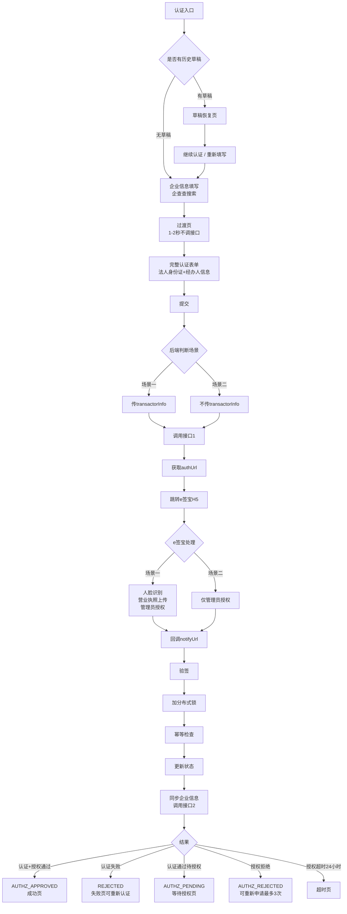

# 企业认证业务流程图 v1.3

**版本**：v1.3
**日期**：2026-05-05
**状态**：已确认

---

## 一、核心业务流程图

```mermaid
flowchart LR
    A[用户提交表单] --> B{后端判断<br/>auth_status}

    B -->|UNVERIFIED(0)| C[场景一：首次认证]
    B -->|其他状态| D[场景二：已认证授权]

    C --> E[传transactorInfo]
    D --> F[不传transactorInfo]

    E --> G[调用接口1]
    F --> G

    G --> H[获取authUrl<br/>authFlowId]
    H --> I[跳转e签宝H5]

    I --> J{e签宝处理}

    J -->|场景一| K[人脸+营业执照<br/>+授权]
    J -->|场景二| L[仅授权]

    K --> M[回调notifyUrl]
    L --> M

    M --> N[后端验签<br/>更新状态]
    N --> O[完成]

    style A fill:#e6f7ff,stroke:#1890ff
    style C fill:#d4edff,stroke:#1890ff
    style D fill:#ffe6e6,stroke:#cf1322
    style O fill:#eafaf1,stroke:#07c160
    style K fill:#fff7e6,stroke:#fa8c16
    style L fill:#fff7e6,stroke:#fa8c16
```

---

## 二、关键差异点

| 参数 | 场景一（首次） | 场景二（已认证） |
|------|---------------|-----------------|
| auth_status | UNVERIFIED(0) | 非UNVERIFIED |
| transactorInfo | ✅ 传 | ❌ 不传 |
| businessScene | FIRST_TIME | ALREADY_AUTH |
| e签宝流程 | 人脸+营业执照+授权 | 仅授权 |

---

## 三、状态机

| 状态值 | 状态名 | 含义 |
|--------|--------|------|
| UNVERIFIED (0) | 未认证 | 初始状态 |
| DRAFT (1) | 草稿 | 有未完成认证 |
| VERIFYING (2) | 认证中 | 已提交等待回调 |
| REJECTED (4) | 认证失败 | 可重新认证 |
| AUTHZ_PENDING (5) | 授权待处理 | 等待管理员审批 |
| AUTHZ_APPROVED (6) | 授权通过 | 可签合同 |
| AUTHZ_REJECTED (7) | 授权拒绝 | 可重新申请 |

---

## 四、认证/授权完整流程



---

## 五、关键注意点

| # | 注意点 | 说明 |
|---|--------|------|
| D1 | 后端判断场景，前端统一表单 | 场景判断在后端，不在前端 |
| D2 | transactorInfo 场景差异 | 场景一传，场景二不传 |
| D3 | 草稿永久保存 | 任何环节可保存，后续继续 |
| D4 | 认证失败可重新认证 | 数据回填，直接修改 |
| D5 | 授权重试最多3次 | 第4次返回400错误 |
| D6 | 授权超时24小时 | 超时自动失效 |
| D7 | 回调幂等处理 | 同一authFlowId只处理一次 |
| D8 | 验签必要性 | 所有回调必须验签 |
| D9 | redirectUrl配置 | 小程序需指向中间H5页 |
| D10 | clientType传值 | 小程序必须传 MINI_APP |
| D11 | 业务域名配置 | 微信公众平台配置 openapi.esign.cn |
| D12 | X-Platform头 | 小程序必须传 X-Platform: miniapp |
| D13 | 场景二法人身份证回填 | 后端自动回填，前端只读 |
| D14 | 授权弹窗触发 | 后端判断已认证后，前端弹授权申请 |

---

**文档状态**：已确认