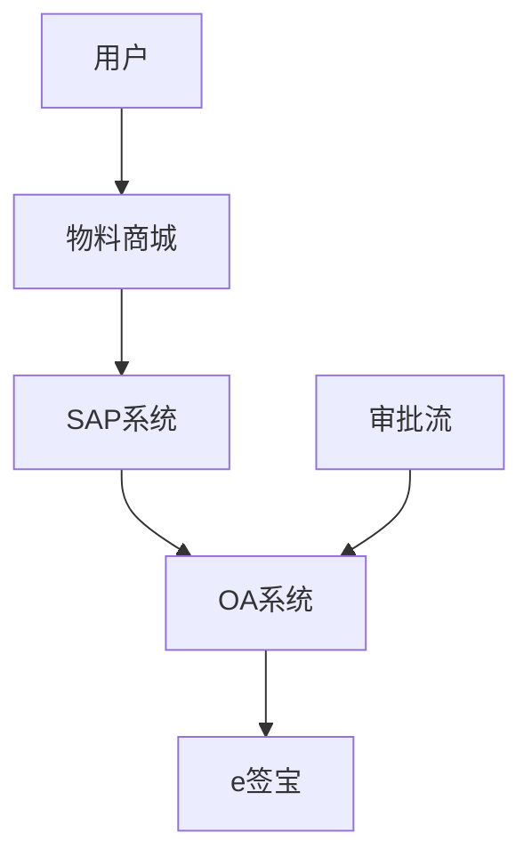
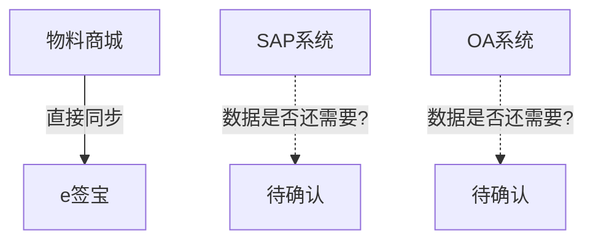

# 企业认证改造项目 - 工作文档 v1.0

**创建日期**：2026-05-04
**版本**：v1.0
**负责人**：待确认
**状态**：需求梳理中

---

## 一、项目背景

### 1.1 当前流程

```
物料商城 → SAP → OA → e签宝
     ↓
企业认证数据同步路径
```

### 1.2 改造目标（待确认）

| 选项 | 描述 | 状态 |
|------|------|------|
| 方案A | 物料商城 → 直接同步 → e签宝（绕过SAP/OA） | 待评估 |
| 方案B | 物料商城 → SAP → OA → e签宝（保持现有路径） | 待评估 |
| 方案C | 其他方案 | 待讨论 |

### 1.3 待确认的核心问题

> ⚠️ **以下问题必须在评审前确认，否则项目风险极大**

| # | 问题 | 业务方确认 | 开发确认 | 影响 |
|---|------|-----------|---------|------|
| 1 | 为什么需要SAP同步？SAP中的认证数据做什么用？ | ❓ | ❓ | 高 |
| 2 | 为什么需要OA同步？OA中用认证状态做什么？ | ❓ | ❓ | 高 |
| 3 | 如果改成直接调e签宝，SAP/OA的数据是否还需要保留？ | ❓ | ❓ | 高 |
| 4 | 是否还有其他系统依赖SAP/OA中的认证数据？ | ❓ | ❓ | 高 |
| 5 | 现有的SAP/OA接口是谁维护的？ | ❓ | ❓ | 中 |

---

## 二、数据流向分析

### 2.1 当前数据流向（待确认）



### 2.2 方案A数据流向（改造后）



### 2.3 数据用途确认表

| 数据项 | SAP用途 | OA用途 | e签宝用途 | 是否可缺失 |
|--------|--------|--------|-----------|-----------|
| 认证状态 | ❓ | ❓ | ✅ 必需 | ❓ |
| 认证时间 | ❓ | ❓ | ✅ 必需 | ❓ |
| 企业信息 | ❓ | ❓ | ✅ 必需 | ❓ |
| 授权状态 | ❓ | ✅ 可能 | ✅ 必需 | ❓ |

---

## 三、风险评估

### 3.1 风险矩阵

| 风险 | 可能性 | 影响 | 等级 | 应对措施 |
|------|--------|------|------|---------|
| 业务需求不清晰 | 高 | 高 | 🔴 重大 | 增加需求澄清环节 |
| SAP/OA接口变更影响不明 | 高 | 高 | 🔴 重大 | 开发先做影响分析 |
| 测试范围不明确 | 中 | 高 | 🟠 重要 | 明确测试边界 |
| 干系人职责不清 | 中 | 中 | 🟡 中等 | 邮件确认角色 |
| 上线后数据不一致 | 中 | 高 | 🟠 重要 | 上线前数据校验 |

### 3.2 风险应对策略

#### 🔴 风险1：业务需求不清晰

**表现**：业务方说不清要做什么，SAP/OA为什么要同步

**应对步骤**：
1. 找业务方要"现有流程文档"
2. 如果没有，约业务方1对1梳理
3. 画出流程图，发邮件确认
4. 直到业务方书面确认

**邮件模板**：
```
主题：确认 - 企业认证当前数据流向

各位：

根据我们的讨论，我梳理了当前数据流向如下：

[流程图/表格]

请确认：
1. 这个流程是否正确？
2. SAP中保存的认证数据用途是什么？
3. OA中使用的认证状态是什么场景？

请回复确认，如有补充请说明。
截止时间：XX月XX日
```

#### 🔴 风险2：SAP/OA接口变更影响不明

**表现**：开发说"不确定改了会有什么影响"

**应对步骤**：
1. 让开发列出"所有调用SAP/OA认证数据的接口"
2. 评估每个接口的用途和影响
3. 确认哪些接口必须保留
4. 给出改 vs 不改的对比分析

**开发需要输出的文档**：
```
1. SAP接口清单（哪些接口用到认证数据）
2. OA接口清单（哪些审批流用到认证状态）
3. 方案A技术可行性评估（改动点、风险点）
4. 方案B技术可行性评估（改动点、风险点）
5. 回归测试范围
```

---

## 四、干系人确认

### 4.1 干系人矩阵

| 角色 | 姓名 | 职责 | 联系方式 | 确认状态 |
|------|------|------|---------|---------|
| 项目总负责人 | ❓ | 对项目结果负责 | ❓ | ❌ 未确认 |
| 业务负责人 | ❓ | 拍板业务流程 | ❓ | ❌ 未确认 |
| SAP负责人 | ❓ | SAP接口变更确认 | ❓ | ❌ 未确认 |
| OA负责人 | ❓ | OA接口变更确认 | ❓ | ❌ 未确认 |
| 开发负责人 | ❓ | 技术方案决策 | ❓ | ❌ 未确认 |
| 测试负责人 | ❓ | 测试计划制定 | ❓ | ❌ 未确认 |

### 4.2 邮件确认模板

```
主题：确认 - 企业认证改造项目干系人角色

各位好：

为了推进企业认证改造项目，需要明确各角色职责：

请确认以下角色和负责人：

1. 项目总负责人：________________（对项目结果负责）
2. 业务负责人：________________（对业务流程拍板）
3. SAP接口负责人：________________（接口变更确认）
4. OA接口负责人：________________（接口变更确认）
5. 开发负责人：________________（技术方案决策）
6. 测试负责人：________________（测试计划制定）

如有人在负责，请回复"确认"；
如人员有误，请指出正确人选。

截止时间：XX月XX日
```

---

## 五、工作计划

### 5.1 分阶段计划

| 阶段 | 时间 | 目标 | 产出 | 负责人 |
|------|------|------|------|--------|
| **第一阶段：信息收集** | 1-2天 | 搞清楚现状 | 流程图+信息表 | PM |
| **第二阶段：方案评估** | 2-3天 | 评估可行性 | 技术方案对比 | 开发 |
| **第三阶段：评审准备** | 1-2天 | 准备材料 | 评审PPT/文档 | PM |
| **第四阶段：项目评审** | 半天 | 决策+排期 | 会议纪要+计划 | 全体 |
| **第五阶段：执行** | 待定 | 开发+测试 | 上线 | 开发+测试 |

### 5.2 第一阶段详细任务

| # | 任务 | 产出 | 负责人 | 截止时间 |
|---|------|------|---------|---------|
| 1 | 约开发负责人1对1沟通 | 了解当前系统架构 | PM | 月日 |
| 2 | 约业务方关键人沟通 | 了解业务背景 | PM | 月日 |
| 3 | 画出当前数据流向图 | 流程图 | PM | 月日 |
| 4 | 确认SAP数据用途 | 信息确认表 | 业务方 | 月日 |
| 5 | 确认OA数据用途 | 信息确认表 | 业务方 | 月日 |
| 6 | 确认干系人角色 | 邮件确认 | PM | 月日 |
| 7 | 汇总信息收集报告 | 报告 | PM | 月日 |

### 5.3 第二阶段详细任务

| # | 任务 | 产出 | 负责人 | 截止时间 |
|---|------|------|---------|---------|
| 1 | 开发评估方案A技术可行性 | 技术报告 | 开发 | 月日 |
| 2 | 开发评估方案B技术可行性 | 技术报告 | 开发 | 月日 |
| 3 | 开发列出SAP/OA接口清单 | 接口清单 | 开发 | 月日 |
| 4 | 开发评估测试范围 | 测试范围 | 开发 | 月日 |
| 5 | PM制作方案对比表 | 对比表 | PM | 月日 |
| 6 | 业务方确认选择方案 | 决策记录 | 业务方 | 月日 |

---

## 六、会议管理

### 6.1 会议纪要模板

```
主题：【会议纪要】企业认证改造项目 - 第X次讨论

会议时间：XXXX年XX月XX日 XX:XX
参会人员：
- 
记录人：

【讨论内容】

1. [议题1]
   - 讨论结论：
   - 待确认事项：

2. [议题2]
   - 讨论结论：
   - 待确认事项：

【待确认事项清单】

| # | 事项 | 负责人 | 截止时间 | 状态 |
|---|------|--------|---------|------|
| 1 | | | | 待确认 |
| 2 | | | | 待确认 |

【下一步计划】

1.
2.

请各位确认以上内容，如有补充请回复邮件。
```

### 6.2 会议前准备清单

```
□ 确定参会人（提前1天通知）
□ 准备讨论议题（提前发邮件）
□ 准备相关材料（流程图、数据表）
□ 确认讨论目标（要有结论）
□ 预约会议室/在线会议
```

### 6.3 会议后跟进清单

```
□ 发送会议纪要（24小时内）
□ 追踪待确认事项
□ 更新任务清单
□ 确认下次会议时间
```

---

## 七、交付物清单

| # | 交付物 | 状态 | 负责人 |
|---|--------|------|--------|
| 1 | 当前数据流向图 | 待制作 | PM |
| 2 | 信息收集表 | 待制作 | PM |
| 3 | SAP接口清单 | 待开发输出 | 开发 |
| 4 | OA接口清单 | 待开发输出 | 开发 |
| 5 | 方案A技术可行性报告 | 待开发输出 | 开发 |
| 6 | 方案B技术可行性报告 | 待开发输出 | 开发 |
| 7 | 方案对比分析表 | 待PM制作 | PM |
| 8 | 项目评审PPT | 待制作 | PM |
| 9 | 项目计划 | 待评审后 | PM+开发 |
| 10 | 测试用例 | 待开发后 | 测试 |

---

## 八、甩锅/背锅防范指南

### 8.1 核心原则

> **所有决策要有书面记录，所有未知要变成任务追踪**

### 8.2 常见场景应对

#### 场景1：业务说"直接改就行，不需要确认"

**邮件回复**：
```
理解您的想法，但改动涉及以下风险：

1. SAP同步逻辑变更 → 影响XXX系统
2. OA审批流依赖 → 可能导致审批异常
3. 数据迁移问题 → 需要确认历史数据处理

建议先完成以下确认，再推进：
- [ ] SAP数据用途确认
- [ ] OA数据用途确认
- [ ] 影响范围评估

如坚持立即推进，请书面说明"已知风险，同意继续"。
```

#### 场景2：开发说"不确定能不能改"

**邮件回复**：
```
明白，开发侧需要先评估。

请在XX月XX日前输出：
1. 技术可行性评估
2. 改动工作量
3. 测试范围

如有问题无法评估，请列出具体阻塞点。
```

#### 场景3：业务和开发"互相踢皮球"

**邮件模板**：
```
各位：

当前存在以下问题无法推进，请确认：

问题1：[具体描述]
- 业务方的说法：XXX
- 开发侧的说法：XXX

需要在XX月XX日前确认：
- 这个问题谁负责确认？
- 确认的标准是什么？

请回复。
```

### 8.3 邮件记录规范

```
1. 主题明确：[需要确认] / [风险预警] / [决策请求]
2. 内容结构：问题 → 影响 → 需要谁确认 → 截止时间
3. 发送范围：相关干系人 + 上级领导
4. 后续追踪：每次回复都要回复，保留记录
```

---

## 九、附录

### 9.1 关键词定义

| 术语 | 定义 |
|------|------|
| 方案A | 物料商城直接调e签宝，跳过SAP/OA |
| 方案B | 保持现有路径，物料商城→SAP→OA→e签宝 |
| 主数据源 | 数据的原始来源系统 |
| 回调 | e签宝认证完成后通知商城的机制 |

### 9.2 参考文档

| 文档 | 路径/链接 | 说明 |
|------|----------|------|
| 企业认证PRD | https://connie-316.github.io/enterprise-auth-docs/prd.html | 当前e签宝对接逻辑 |
| PC原型 | https://connie-316.github.io/enterprise-auth-docs/pc-prototype.html | 交互原型 |
| 小程序原型 | https://connie-316.github.io/enterprise-auth-docs/mini-prototype.html | 交互原型 |

### 9.3 更新记录

| 版本 | 日期 | 修改内容 | 修改人 |
|------|------|---------|--------|
| v1.0 | 2026-05-04 | 初始版本 | PM |

---

**文档状态**：草稿
**下次更新**：完成信息收集阶段后